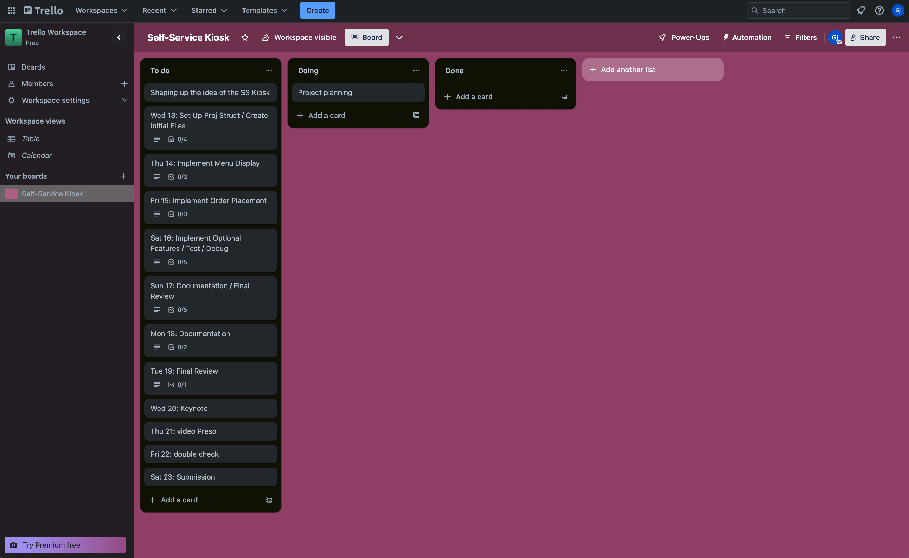
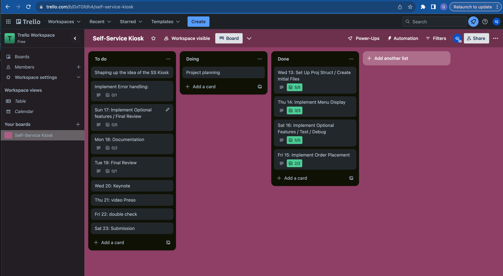
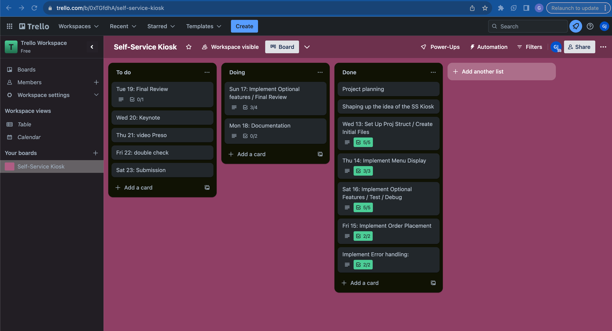

# Gustavo Jimenez T1A3 - Self Service Kiosk
  
### R1. Answers to all the documentation requirements below.

### R2. Your README.md should have a separate heading for each documentation requirement and answers organised under the appropriate headings.

### R3. Provide full attribution to referenced sources (where applicable).
rich ---- https://www.youtube.com/watch?v=4zbehnz-8QU
alive-progress --- https://pypi.org/project/alive-progress/
json files --- https://www.pythoncheatsheet.org/cheatsheet/json-yaml

### R4. Provide a link to your source control repository
- ### [GustavoJimenez_T1A3-GitProject](https://github.com/Gus14939/GustavoJimenez_T1A3)
    
### R5. Identify any code style guide or styling conventions that the application will adhere to.  
- Reference the chosen style guide appropriately.

##### I revised the code, it should be well-organized and follows PEP 8 and PEP 257 conventions. Here are a few points I kept in mind:
 
 - Imports: Kept them at the top, but re-organised and grouped appropriately.

 - Whitespace: use of whitespace is maintained around operators and after commas.

 - Indentation: The code is consistently indented using 4 spaces per level.

 - String Formatting: F-strings are used for string formatting, which is more concise and readable.
    - Some string were not F-string for personal readability 

 - Comments/Docstrings: Applied informative comments, I used triple double-quotes.

 - Function Documentation: Functions have docstrings describing their purpose, parameters, and return values.

 - Variable Names: Variable names are descriptive, and there are no formats inconsistencies.

 - Consistent Case format: Snake case for both variable and function names.

### R6. Develop a list of features that will be included in the application. It must include:

- at least THREE features
- describe each feature

    #### User-friendly interface:  
    The interface should be easy to navigate and understand, with clear instructions and options for the user. Displaying the menu in a clear and organised manner, with categories and prices for each item.

    #### Create user registration, user login, login password recovery, and continue as visitor
    - Allowing and encouraging users to register to have access to special products on the menu and other perks. 
    - Password and login to access the specials and have a personal database
    - Password recovery, if the user forgot the code, this can be retrieved by providing name and birthday.
    - A simple continue as visitor or first time buyer

    #### User Order tracking:  
    Providing users with personal database to provide special products, customised orders, provide discounts.

    #### Order display and remove items:  
    Allowing users to add and preview the order. Remove unwanted items, preview and continue with purchase

    #### Order Finalization:  
    After the user has reviewed their order, the kiosk should confirm the order and display a message with an estimated wait time. It should also provide a receipt with the order details and total cost.

    #### Order time to prepare:
    Allowing users to see the time it will take and a progress bar indicating when the meal would be ready

    Note: Ensure that your features above allow you to demonstrate your understanding of the following language elements and concepts:
        - use of variables and the concept of variable scope
        - loops and conditional control structures
        - error handling

    - Consult with your educator to check your features are sufficient.

    ### [My Wireframe/Diagram](https://drive.google.com/file/d/1L3Ua_SGRIWJWtKAxmnS1D9oPsWyiOnRA/view?usp=sharing)

### R7. Develop an implementation plan which:

---  
Set Up Project Structure:

Create a new Python project directory.

Set up version control (e.g., Git) for your project.

Create Initial Files:

Create a main Python script (e.g., ordering_kiosk.py) to serve as the entry point for your application.

Create a menu file (e.g., menu.json) to store your menu items.
---

### [Link to my project in Trello](https://trello.com/invite/b/0xTGfdhA/ATTI723b81d85f9412b7a5f41b8c794eadfc665F35AE/self-service-kiosk)

### R8. Design help documentation which includes a set of instructions which accurately describe how to use and install the application.

You must include:
- steps to install the application
- any dependencies required by the application to operate
- any system/hardware requirements
- how to use any command line arguments made for the application